# ASL Pilot

Browser-first ASL 1 vocabulary practice pilot — academic / school project under deadline pressure. Derived from `superbuilders-partner-project-asl-learning-with-computer-vision.pdf`. The repo is a single-developer monorepo: a Next.js 16 / React 19 app under `web/`, a Python 3.14 / PyTorch 2.12 training pipeline under `scripts/`, a reviewer-authority + audit chain across `docs/` and `data/`, and a file-backed Codex executor + Codex observer loop.

## What this project is

A learner opens [the practice page](web/src/app/page.tsx), selects an ASL 1 prompt (one of 100 source-curated items in [`web/src/lib/vocabulary.ts`](web/src/lib/vocabulary.ts)), grants camera permission, signs the prompt locally, and receives a typed pass/fail decision plus a non-diagnostic coaching hint. Attempts are persisted (metadata only — raw frames stay in the browser).

The recognition lane is **rawframe-from-scratch only**. No pretrained CV / sign / landmark / model dependencies in the promoted code path. See [`ARCHITECTURE.md#arch-no-pretrained`](ARCHITECTURE.md#arch-no-pretrained).

## Final demo pipeline

The assignment-demo recognizer uses the run10 practice-feedback path, documented
with evidence links in [`docs/model/final-demo-pipeline.md`](docs/model/final-demo-pipeline.md).
It is demo evidence only: the public model card remains `not_trained`, and
`docs/model/active-vocabulary-claim.json` still has no active labels.

```mermaid
flowchart LR
  Source["Approved source videos<br/>PopSign plus school-assignment ASL Citizen"] --> Rights["Source register<br/>rights, splits, attribution"]
  Rights --> Labels["Offline teacher labels<br/>supervision only"]
  Labels --> SimCC["Scratch SimCC w48<br/>hand landmark student"]
  SimCC --> Cache["T=32 sequence cache<br/>90 features per frame"]
  Cache --> Run10["Run10 Transformer recognizer<br/>recall at FAR10: 0.9209"]
  Run10 --> Thresholds["Monitor-fit thresholds<br/>honest recall: 0.9087 at FAR 0.088"]
  Thresholds --> Browser["Browser /practice demo<br/>local camera, practice feedback"]
  Browser --> Boundary["Claim boundary<br/>no grading; no product promotion"]
```



## What this project is NOT

- Not sentence-level ASL recognition.
- Not open-vocabulary recognition.
- Not classroom assessment.
- Not multilingual sign translation.
- Not a production-scale public deployment.
- Not a trained model (yet — see "Current state" below).

## Current state (Mission 3AC, small-proof selection and gates)

| component | status |
|---|---|
| Browser app shell + auth + practice flow + camera permission states | DONE end-to-end ([`web/src/components/PracticeApp.tsx`](web/src/components/PracticeApp.tsx); Playwright evidence at [`docs/validation/practice-camera-behavior-smoke.json`](docs/validation/practice-camera-behavior-smoke.json) status `passed`) |
| Typed `InferenceEngine` + `PassFailDecision` modules | DONE ([`web/src/lib/inference-engine.ts`](web/src/lib/inference-engine.ts), [`web/src/lib/pass-fail-decision.ts`](web/src/lib/pass-fail-decision.ts)) |
| 100 source-curated ASL 1 vocabulary items | DONE ([`web/src/lib/vocabulary.ts`](web/src/lib/vocabulary.ts), [`docs/review/final-vocabulary-review.json`](docs/review/final-vocabulary-review.json) `status: source_curated`) |
| Structured per-dimension hint metadata | PARTIAL — 19/100 signs ([`web/src/lib/sign-hint-metadata.json`](web/src/lib/sign-hint-metadata.json)); expanding requires reviewer-grade ASL knowledge for the remaining signs |
| Active-vocabulary-claim wired to UI | DONE ([`docs/model/active-vocabulary-claim.json`](docs/model/active-vocabulary-claim.json) served via [`web/src/app/api/model/active-vocabulary-claim/route.ts`](web/src/app/api/model/active-vocabulary-claim/route.ts); rendered as `Content-only` badge per prompt) |
| Browser ONNX inference path | DONE (wiring + parity smoke) — [`scripts/run_browser_onnx_wiring_smoke.mjs`](scripts/run_browser_onnx_wiring_smoke.mjs) passes against [`web/public/model/asl-pilot-rawframe-v0.onnx`](web/public/model/) |
| Browser model-card promotion | NOT_TRAINED — [`web/public/model/model-card.json`](web/public/model/model-card.json) is `status: not_trained`. Promotion goes through [`scripts/promote_trained_model_card.mjs`](scripts/promote_trained_model_card.mjs) and only after Brev training + signer-disjoint validation |
| First-party consented dataset collection runbook + runtime smoke | DONE for the future first-party lane ([`docs/runbooks/first-party-collection.md`](docs/runbooks/first-party-collection.md); [`docs/validation/dataset-collection-runtime-smoke.json`](docs/validation/dataset-collection-runtime-smoke.json) status `passed`, `finality: smoke_only`); not the current automatic blocker |
| Storage guardrail + Brev provisioning/sync/stop scripts | DONE ([`scripts/storage_budget_check.sh`](scripts/storage_budget_check.sh), [`scripts/brev_create_48h.sh`](scripts/brev_create_48h.sh), [`scripts/brev_sync_repo.sh`](scripts/brev_sync_repo.sh), [`scripts/brev_stop_all_training.sh`](scripts/brev_stop_all_training.sh)); handoff in [`docs/runbooks/brev-rawframe-training-handoff.md`](docs/runbooks/brev-rawframe-training-handoff.md) |
| Return-to-form plan spine | ACTIVE ([`docs/model/return-to-form-plan.md`](docs/model/return-to-form-plan.md)); broad 75/95-label rawframe runs are paused until a 5-10 sign fixed-crop learnability proof exists |
| First-party clip collection against real signers | FUTURE / TACTICAL DATA LANE - useful if selected deliberately, but not the current automatic route |
| Brev training round | PAUSED for broad runs; the last controlled clip-heldout branch produced retained evidence but no useful 95-label learning signal |
| Signer-disjoint validation metrics + calibrated threshold + model-card promotion | PENDING (gated on training) |
| Codex executor + Codex observer loop | DONE ([`docs/runbooks/codex-goal-loop.md`](docs/runbooks/codex-goal-loop.md), [`docs/observer-prompt.md`](docs/observer-prompt.md), [`docs/runbooks/observer-runbook-codex.md`](docs/runbooks/observer-runbook-codex.md), [`scripts/start_codex_goal_loop.sh`](scripts/start_codex_goal_loop.sh)) |

The current pilot is therefore **not complete**. The active work is
`Mission 3AC: small-proof selection and gates`, scoped in
[`GOAL.md`](GOAL.md), [`docs/model/return-to-form-plan.md`](docs/model/return-to-form-plan.md),
and [`docs/model/return-to-form-small-proof-goal-loop-prompt.md`](docs/model/return-to-form-small-proof-goal-loop-prompt.md).
The current step is not training. It is selecting a 5-sign Tier 0 proof set,
writing source/coverage evidence, committing a fixed crop config, and setting
validation gates before any small training smoke.

## Repo layout

```
.
├── README.md                  ← you are here
├── LICENSE.md                 ← noncommercial academic project; no redistribution grant by default
├── GOAL.md                    ← active Codex goal loop prompt (executor re-reads this every turn)
├── ARCHITECTURE.md            ← anchored invariants (#arch-no-pretrained, #arch-active-module, etc.)
├── DECISIONS.md               ← locked / open / deferred decisions
├── MVP_TASKS.md               ← annotated task graph with repo-state per task
├── STAGE_GATE_STATUS.md       ← where the round is
├── docs/
│   ├── runbooks/              ← operator runbooks (Brev handoff, first-party collection, Codex observer, vocabulary review)
│   ├── session-logs/          ← per-slice narrative
│   ├── model/                 ← per-milestone goal-loop prompts + active-vocabulary-claim.json
│   ├── review/                ← source-curated + reviewer-authority chain artifacts
│   ├── validation/            ← retained smoke + audit reports
│   └── strategy-confidence-audit.md  ← 95+ hard gates
├── web/                       ← Next.js 16 / React 19 / TypeScript / Tailwind v4 / ONNX Runtime Web
├── scripts/                   ← 200+ audit / smoke / training / export scripts (Node + Python)
├── data/                      ← signer identity, vocabulary review, dataset manifests (consented evidence; raw signer data never committed)
└── .claude/                   ← legacy Claude command/hook scaffolding (not the active loop)
```

## Run the app locally

```sh
cd web
npm install
npm run dev -- --hostname 127.0.0.1 --port 3025
```

Open `http://127.0.0.1:3025`. Practice flow works end-to-end; the model card is `not_trained` so attempts are saved with `passed: false` and a "model not trained yet" hint until a real trained card is promoted.

To exercise the explicit-consent dataset-collection lane (for the runbook smoke OR a real collection session), rebuild with the flag enabled (the build-time gate is intentional):

```sh
NEXT_PUBLIC_ENABLE_DATASET_COLLECTION=true \
ENABLE_DATASET_COLLECTION=true \
  npm --prefix web run build
```

After the session, a plain `npm --prefix web run build` restores the default-safe build.

## Verify the lane (essential audits)

**Recommended entry point** — runs the essential no-regression audit chain in one command, fast-fails on first failure, prints a green summary on success, logs a one-line record to `docs/validation/preflight-runs.log` (gitignored):

```sh
bash scripts/preflight.sh           # full chain (~15 checks; ~12 seconds)
bash scripts/preflight.sh --fast    # skip web build + ONNX wiring smoke (~12 checks; ~5 seconds)
```

For reference, the individual audits the preflight composes — run from the repo root. The full audit chain (200+ scripts) is enumerated in [`MVP_TASKS.md`](MVP_TASKS.md) per task.

```sh
# No-pretrained invariants (must stay clean at all times)
node scripts/audit_no_pretrained_deps.mjs
node scripts/audit_no_pretrained_artifact_json.mjs

# Privacy + camera + practice contracts
node scripts/audit_no_raw_video_upload.mjs
node scripts/audit_practice_screen_contract.mjs
node scripts/audit_browser_compatibility.mjs

# Vocabulary + hint chain
node scripts/audit_vocabulary_review.mjs
node scripts/audit_hint_pedagogy_review.mjs
node scripts/audit_downstream_vocabulary_provenance.mjs
node scripts/audit_source_register.mjs

# Storage + environment
bash scripts/storage_budget_check.sh
./.venv/bin/python scripts/audit_local_ml_environment.py --write-report docs/validation/local-ml-environment.json --report docs/validation/local-ml-environment.json

# Web sanity
npm --prefix web run lint
npm --prefix web run typecheck
npm --prefix web run build

# Retained runtime smokes + their audits
node scripts/run_browser_onnx_wiring_smoke.mjs --write && node scripts/audit_browser_onnx_wiring_smoke.mjs
node scripts/run_practice_progress_smoke.mjs --write && node scripts/audit_practice_progress_smoke.mjs
node scripts/run_practice_camera_behavior_smoke.mjs --write && node scripts/audit_practice_camera_behavior_smoke.mjs
node scripts/audit_dataset_collection_runtime_smoke.mjs
```

The final completion gate intentionally fails until the trained model + manifests + validation evidence exist:

```sh
node scripts/audit_completion_readiness.mjs --read-only --summary-only
```

## Operator workflows

**Start here:** [`docs/handoff/RESUME.md`](docs/handoff/RESUME.md) — single-page tl;dr of where the project stands, what was built, what the two human-action gates are, and how to resume the loop.

Operator-facing runbooks document the human-only paths:

- [`docs/runbooks/brev-rawframe-training-handoff.md`](docs/runbooks/brev-rawframe-training-handoff.md) - Brev create/sync/train/copy-back/stop sequence; broad runs are paused until the return-to-form proof reselects a small training target.
- [`docs/runbooks/first-party-collection.md`](docs/runbooks/first-party-collection.md) — collect consented signer clips -> review -> manifest export for a future first-party training-data lane.
- [`docs/runbooks/vocabulary-reviewer-chain.md`](docs/runbooks/vocabulary-reviewer-chain.md) — add a vocabulary item OR commission external Ed25519-signed review.
- [`docs/runbooks/observer-runbook-codex.md`](docs/runbooks/observer-runbook-codex.md) — Codex observer side of the autonomous loop, including [`bash scripts/watch_observer.sh`](scripts/watch_observer.sh) for live tailing.

## Autonomous loop

Two Codex roles coordinate through repo files and commits, both defined in [`docs/autonomous-orchestrator-protocol.md`](docs/autonomous-orchestrator-protocol.md) and [`docs/runbooks/codex-goal-loop.md`](docs/runbooks/codex-goal-loop.md):

- **Executor = Codex**. Each turn re-reads `GOAL.md` plus the active prompt, executes exactly one reviewable slice, validates it, writes a session log, commits locally, then stops if the next step needs human approval.
- **Observer = Codex**. Reads [`docs/observer-prompt.md`](docs/observer-prompt.md), decides CONTINUE / NUDGE / REDIRECT / STOP / ESCALATE, and acts only through the observer runbook.

Start both roles with:

```sh
bash scripts/start_codex_goal_loop.sh --role both
```

Halt: place `<stop-orchestrator/>` at the top of `GOAL.md`.

## Hard rules (mirror of [`CLAUDE.md`](CLAUDE.md))

- No pretrained CV/sign/landmark/model dependencies in the promoted lane ([`#arch-no-pretrained`](ARCHITECTURE.md#arch-no-pretrained)).
- No raw learner video upload during normal practice ([`#arch-camera-privacy`](ARCHITECTURE.md#arch-camera-privacy)).
- Heavy GPU training → Brev. Smoke / eval / export / audits → local Mac Studio MPS ([`#arch-gpu-execution`](ARCHITECTURE.md#arch-gpu-execution)).
- Do not hand-edit [`web/public/model/model-card.json`](web/public/model/model-card.json); use [`scripts/promote_trained_model_card.mjs`](scripts/promote_trained_model_card.mjs).
- Do not create a parallel audit system; extend the existing `node scripts/audit_*.mjs` chain (200+ scripts).
- Every task cites architecture anchors. Every commit names the task + brief + anchors + check.
- Never push to remote without explicit human go.
- Never `--no-verify` or `--amend` unless explicitly directed.

## History

This README replaced an earlier draft that documented a removed DTW/keypoint academic-benchmark lane (Stage A) along with several deleted scripts and validation artifacts. The deletion happened in mission 1 / task-026 (Stage A vestige removal); see [`docs/session-logs/002-stage-a-vestige-removal.md`](docs/session-logs/002-stage-a-vestige-removal.md). Subsequent missions are documented in [`docs/session-logs/007-loop-exit-exit-condition-met.md`](docs/session-logs/007-loop-exit-exit-condition-met.md) (mission 2 close) and the M3a–M3i logs under [`docs/session-logs/`](docs/session-logs/).
