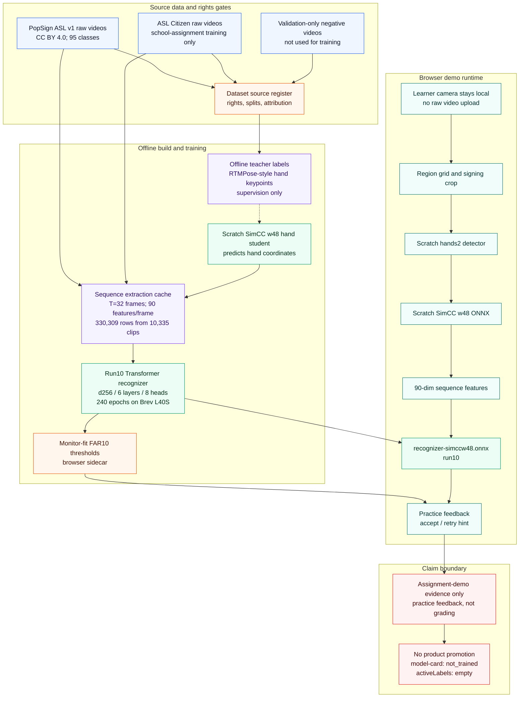

# Final Demo Pipeline Path

This diagram documents the final assignment-demo path for run10. It separates
offline supervision and training from the browser practice-feedback runtime.
The demo recognizer cleared the MVP verification gate, but it is still recorded
as demo evidence only: the public model-card and active vocabulary claim remain
fail-closed.

## Evidence Links

- Active demo decision: [`GOAL.md`](../../GOAL.md)
- Source rights and dataset boundaries: [`dataset-source-register.json`](dataset-source-register.json)
- Run10 training receipt: [`return-to-form-m3jb-recognizer-transformer-run10-simccw48-fulltrain-v1.json`](../validation/return-to-form-m3jb-recognizer-transformer-run10-simccw48-fulltrain-v1.json)
- Run10 trust audit: [`return-to-form-m3jb-run10-trust-audit-v1.json`](../validation/return-to-form-m3jb-run10-trust-audit-v1.json)
- Near-live browser eval: [`return-to-form-m3jb-run10-heldout-nearlive-eval-v1.json`](../validation/return-to-form-m3jb-run10-heldout-nearlive-eval-v1.json)
- PopSign-only fallback / ablation: [`return-to-form-m3jb-run12-popsignonly-v1.json`](../validation/return-to-form-m3jb-run12-popsignonly-v1.json)

## Current Run10 Numbers

| measure | value |
|---|---:|
| Test verification recall at FAR10 | 0.9209 |
| Honest monitor-fit recall on test | 0.9087 |
| Honest realized FAR | 0.0880 |
| Test top-1 | 0.5428 |
| Test top-5 | 0.8261 |
| Near-live browser true accept | 33/40 |
| Near-live browser wrong-prompt accept | 6.1% |

## Boundary Notes

- RTMPose-style labels are offline supervision only. They are not browser
  runtime dependencies and are not shipped as the recognizer.
- The run10 recognizer is the assignment-demo artifact. It is not promoted
  through the rawframe product model-card path.
- ASL Citizen rows improved the run10 training signal but carry noncommercial
  school-assignment constraints. Run12 measures the PopSign-only recognizer
  fallback cost without swapping the deployed demo artifact.
